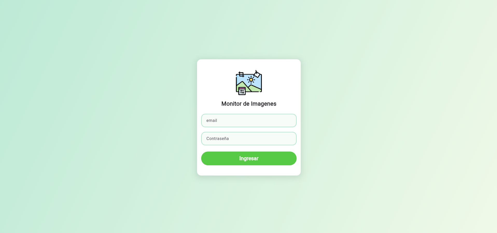
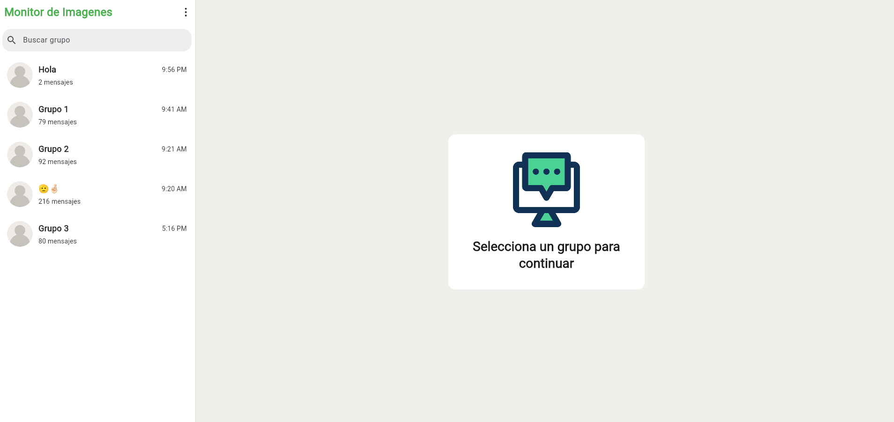
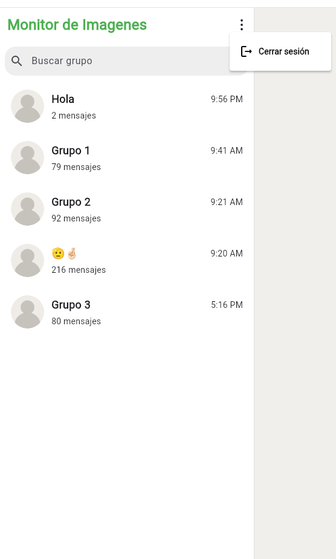
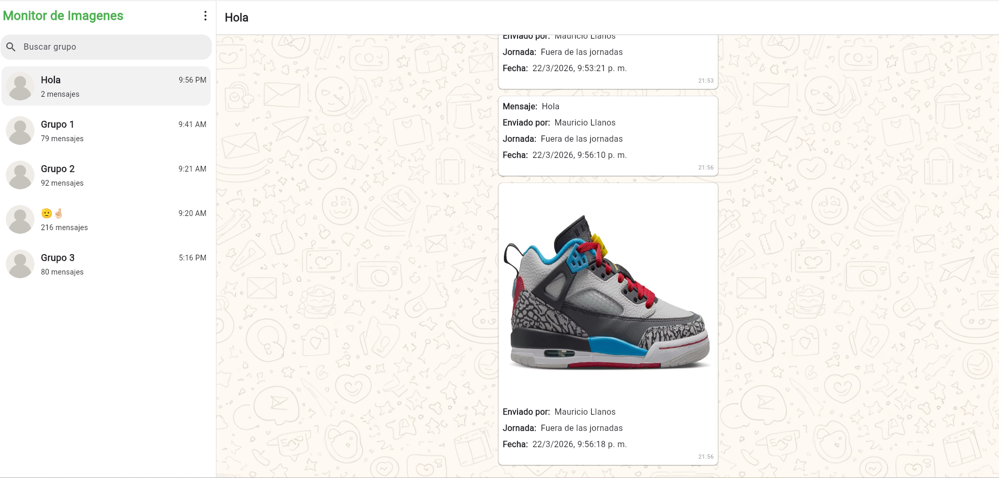
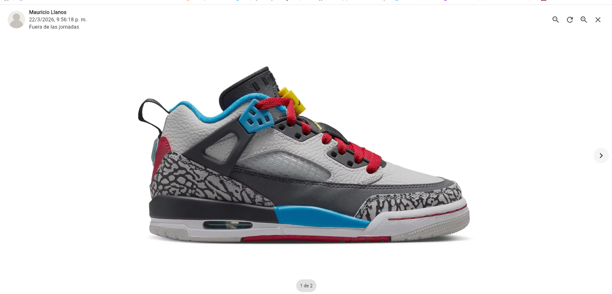

# whatsapp_monitor_viewer

Visor de chats e imagenes de WhatsApp basado en Firebase (Auth, Firestore, Storage) construido con Flutter y Riverpod.


**Capturas**






**Funciones principales**
- Inicio de sesion con Firebase Auth (email y password)
- Listado de grupos con ultima actividad y total de imagenes
- Busqueda rapida de grupos
- Vista de mensajes con paginacion y carga incremental
- Actualizaciones en tiempo real (nuevos mensajes y cambios en grupos)
- Visor de imagenes con ruta dedicada
- Soporte de desktop y web con scroll y drag en mouse/trackpad

**Stack**
- Flutter + Dart
- Riverpod para estado y DI
- go_router para navegacion
- Firebase Auth, Firestore y Storage
- Freezed + build_runner para modelos y estados

**Requisitos**
- Flutter SDK compatible con Dart `^3.10.7`
- Cuenta y proyecto Firebase
- Firestore y Storage habilitados

**Configuracion**
1. Configura un proyecto en Firebase.
2. Habilita Email/Password en Firebase Auth.
3. Crea las colecciones y documentos en Firestore con el esquema minimo indicado abajo.
4. Configura Firebase Storage para servir imagenes y usa `storagePath` en los mensajes.
5. Genera o reemplaza `lib/firebase_options.dart` usando FlutterFire CLI si tu proyecto es diferente.

**Ejecucion**
```bash
flutter pub get
flutter run
```

**Generacion de codigo (Freezed/JSON)**
```bash
flutter pub run build_runner build --delete-conflicting-outputs
```

**Estructura del proyecto**
- `lib/main.dart` entrada, inicializa Firebase y Riverpod
- `lib/app/` configuracion de app, providers y router
- `lib/core/` utilidades, errores, temas y helpers
- `lib/features/auth/` autenticacion
- `lib/features/chats/` listado de chats y busqueda
- `lib/features/messages/` mensajes, imagenes y visor
- `assets/images/` recursos visuales y capturas

**Rutas**
- `/login` pantalla de inicio de sesion
- `/home` layout principal (lista de chats + mensajes)
- `/home/viewer/:index` visor de imagenes

**Modelo de datos (Firestore)**
Coleccion `group_stats` (minimo requerido):
- `chatJid` string
- `groupName` string
- `lastMessageAt` int (timestamp en ms)
- `totalImages` int

Coleccion `whatsapp_messages` (minimo requerido):
- `chatJid` string
- `senderName` string
- `messageTimestamp` int (timestamp en ms)
- `localTime` string
- `hasMedia` bool
- `storagePath` string (opcional, requerido si `hasMedia` es true)
- `caption` string (opcional)

**Comportamiento de mensajes**
- Paginacion inicial de 50 mensajes por chat.
- Scroll inverso (los mas nuevos arriba) con boton para ir al ultimo mensaje.
- Separador por dia y animaciones de entrada.

**Notas**
- Los datos de `messageTimestamp` se convierten a hora local para etiquetas de dia y turno.
- La URL publica de imagen se construye con el bucket de Firebase Storage.

**Recursos**
- Imagenes de UI y fondo en `assets/images/`.
